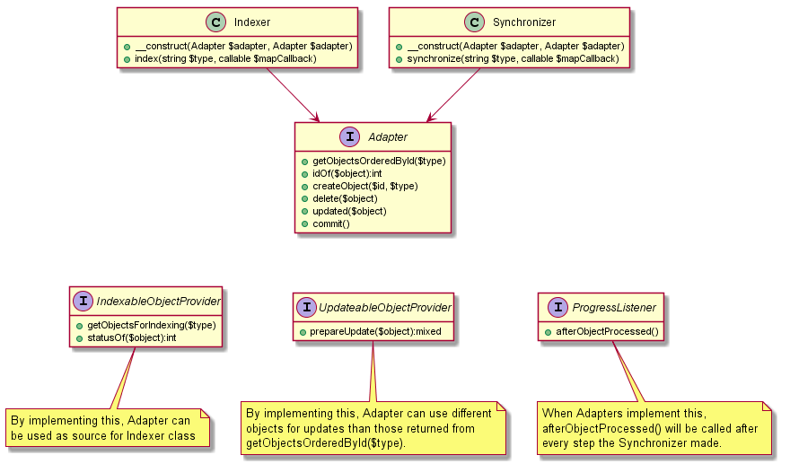

content-mapping
===============

[](https://travis-ci.org/h69/content-mapping)
[](https://coveralls.io/github/h69/content-mapping?branch=master)

content-mapping is a mini framework for mapping content from a source to a destination system. E.g. from Propel objects to Solr, from Doctrine entities to ElasticSearch or from one XML structure to another. It features interfaces to guide you on your mapping way and ships with some abstract implementation helpers or magic implementations.

ATTENTION! This repository is a fork of [webfactory/content-mapping] (https://github.com/webfactory/content-mapping) that aims to have only one type of adapter (instead of source- and destination-adapter) with the ability to also handle indexing instead of synchronizing. The difference between indexing and synchronizing is that indexing returns a queue of items that have been created, updated or deleted instead of returning all items ordered by their id.


Installation
------------

Add this long-time fork of content-mapping as dependency by running the command (see http://getcomposer.org/):

    php composer.phar require h69/content-mapping

and run

    php composer.phar install

Concept
-------



The content-mapping process is based on four parts: the `Synchronizer`, a ``SourceAdapter``, a ``callable Mapper`` and a
``DestinationAdapter``. The entry point is ``Synchronizer->synchronize()``: there, the Synchronizer gets an Iterator
from the ``SourceAdapter->getObjectsOrderedById()`` as well as an Iterator from the
``DestinationAdapter->getObjectsOrderedById()``, and compares the objects in each one. During the comparison, it deletes
outdated objects (``DestinationAdapter->delete()``), stores a new objects (``DestinationAdapter->createObject()``) and
updates existing objects in the destination system (``callable Mapper``).
 
``DestinationAdapter->updated()`` and ``DestinationAdapter->commit()`` are only hooks for external change tracking, to
say an object has been updated or both Iterators have been processed, i.e. changes can be persisted.


Usage
-----

To construct a ``Synchronizer``, you need two implementations for the ``Adapter`` (source and destination) and a callback to map properties from source to destination object. Please find abstract templates and ready-to-use generic implementations of Adapters in the [h69/content-mapping\-\*](https://github.com/search?q=h69%2Fcontent-mapping) or adapt one of [webfactory/content-mapping\-\*](https://github.com/search?q=webfactory%2Fcontent-mapping) to work with the updated interface of this fork. The Mapper usually is very specific for your project, so you probably want to implement it in your application.

```php
use H69\ContentMapping\Synchronizer;
use H69\ContentMapping\Mapper\Result;

$sourceAdapter = ...; // see the readme of the corresponding package on how to construct it
$destinationAdapter = ...; // see the readme of the corresponding package on how to construct it
$typeToSynchronize = 'pages';

$synchronizer = new Synchronizer($sourceAdapter, $destinationAdapter);
$synchronizer->synchronize($typeToSynchronize, function($objectA, $objectB){
    ...
    //return Result::unchanged();
    return Result::changed($updatedObjectB);
});
```

To construct a ``Indexer``, you need two implementations for the ``Adapter`` (source and destination) and a callback to map properties from source to destination object. Please find abstract templates and ready-to-use generic implementations of Adapters in the [h69/content-mapping\-\*](https://github.com/search?q=h69%2Fcontent-mapping) or adapt one of [webfactory/content-mapping\-\*](https://github.com/search?q=webfactory%2Fcontent-mapping) to work with the updated interface of this fork. The Mapper usually is very specific for your project, so you probably want to implement it in your application.

```php
use H69\ContentMapping\Indexer;
use H69\ContentMapping\Mapper\Result;

$sourceAdapter = ...; // see the readme of the corresponding package on how to construct it
$destinationAdapter = ...; // see the readme of the corresponding package on how to construct it
$typeToIndex = 'pages';

$indexer = new Indexer($sourceAdapter, $destinationAdapter);
$indexer->index($typeToSynchronize, function($objectA, $objectB){
    ...
    //return Result::unchanged();
    return Result::changed($updatedObjectB);
});
```


Credits, Copyright and License
------------------------------

This project/fork was started at [webfactory GmbH, Bonn](https://www.webfactory.de) and was/will be further developed by
- [h69](https://github.com/h69)

Copyright 2016. Code released under [the MIT license](LICENSE).
